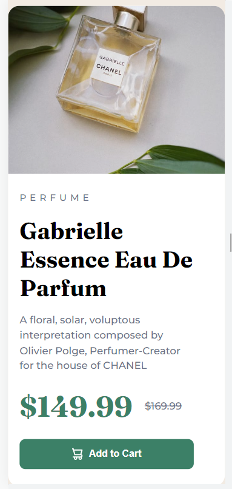

# Product-Card---Frontend-Mentor
This is a challenge from Frontend Mentor to create product card
# Frontend Mentor - Building Product Preview Card Component using HTML & CSS

This is the solution to the Product preview card component challenge on Frontend Mentor.

## Table of Contents

    - Overview
      - The Challenge
      - Screenshot
      - Links
    - My process
      - Built with
      - What I learned
      - Useful Resources
    - Author

## Overview

	### The Challenge

	  This is the challenge from Frontend Mentor to build a product preview
	card by using HTML & CSS. Our Challenge is to build the preview card
	and get it looking as close to the design as possible. Besides, it should
	be able to responsive (adapt to different size of device screen).

	### Solution Screenshot
	  
	  Here are the preview of the product card that I've created.

	  On Desktop
	  

	  On Mobile
	  

	  ### Links
	    Here are the links of the product preview which I've created.
	  
	    - Solution URL :
	    - Live Site URL :

## My Process

	### Built with
	
	This product card is built by using:
	
	  - Semantic HTML5 markup
	  - CSS custom properties
	  - Flexbox

	### What I learned
	  During the process of building this project, I faced a lot of problems.
	By searching through Google and Stackoverflow, I can finally accomplish
	this project although I still realise my solution is not the best.

	Below are some of the important things I learned/got from this project:
	  1. Enhance my skill to build better structure HTML and CSS properties
	  2. How to fit in images into Flexbox
	  3. How to bring out element which got overlapped by another element
	  4. I learn the importance of creating README filE and how to make it

	###Useful Resources
	  - Stackoverflow [https://stackoverflow.com/questions/62506922/how-to-force-an-image-to-shrink-to-fit-in-flexbox]
		This URL helps me to understand how to make an image fit in flexbox container

	  - Stackoverflow [https://stackoverflow.com/questions/44913305/background-color-overlapping-border-radius]
		This URL helps me to understand how to show up the border-radius which got overlapped by another element

	  - Freecodecamp.org [https://www.freecodecamp.org/news/how-to-write-a-good-readme-file/]
		This help me know more about the Importance of README file and how to create one.

## Author

  - Github [Michael Tze] - https://github.com/Biggboss7

